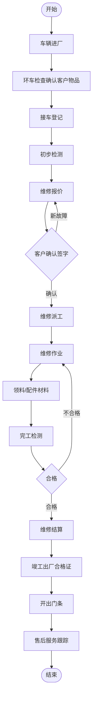
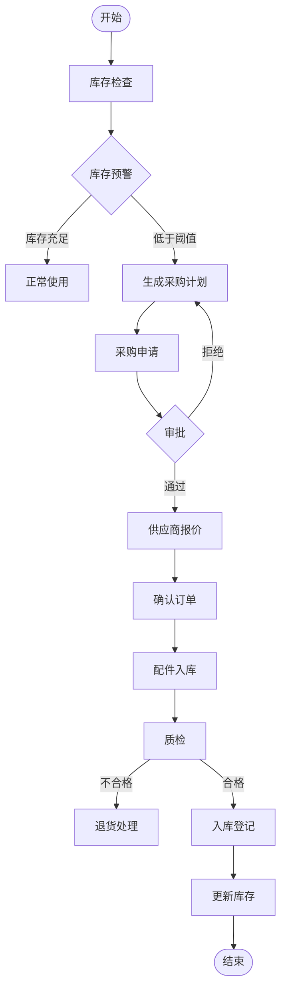
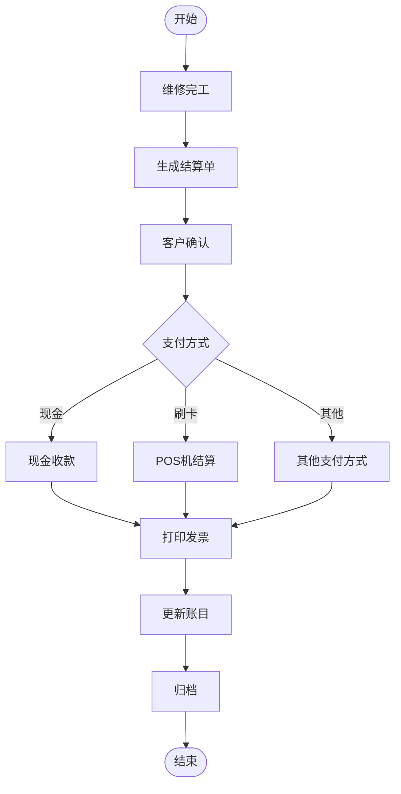
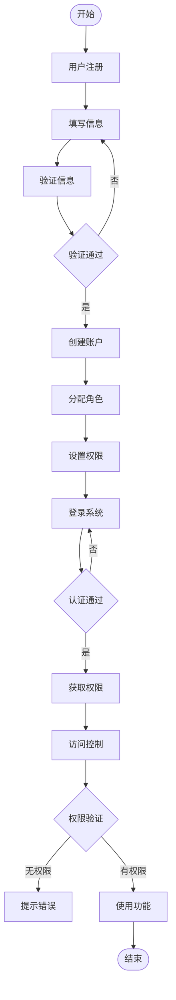

# 汽车维修管理系统

## 维修业务流程图

### 库存管理流程

### 结算流

### 用户权限流程

## 功能模块清单

### 1. 用户管理 ✓

- 用户注册 ✓
- 用户登录 ✓
- 密码修改 ✓
- 个人信息管理 ✓
- 刷新令牌 ✓
- 账号注销 ✓

### 2. 客户管理 ✓

- 新增客户 ✓
- 查询客户列表 ✓
- 查看客户详情 ✓
- 修改客户信息 ✓
- 删除客户 ✓

### 3. 车辆管理 ✓

- 新增车辆 ✓
- 查询车辆列表 ✓
- 查看车辆详情 ✓
- 修改车辆信息 ✓
- 删除车辆 ✓

### 4. 维修工单管理 ❌

- 接车登记 TODO
  - 基本信息登记
  - 环车检查记录
  - 维修需求记录
- 维修报价 TODO
  - 生成报价单
  - 客户确认签字
- 维修处理 TODO
  - 维修派工
  - 配件领用
  - 维修记录
- 完工处理 TODO
  - 完工检测
  - 出厂手续

### 5. 配件库存管理 ❌

- 库存查询 TODO
- 配件出入库 TODO
- 库存预警 TODO
- 供应商管理 TODO

### 6. 结算管理 ❌

- 结算单生成 TODO
- 收款管理 TODO
- 发票管理 TODO

### 7. 系统管理 ❌

- 角色权限管理 TODO
- 系统参数配置 TODO
- 数据字典管理 TODO
- 操作日志查询 TODO
- 系统备份恢复 TODO

## 技术栈

### 后端

- Node.js
- Koa2
- MongoDB
- JWT 认证
- RESTful API

### 开发工具

- Docker ✓
- Git ✓
- Jest (测试) TODO
- Winston (日志) ✓
- ESLint (代码规范) TODO

## 项目进度

- [x] 基础框架搭建
- [x] 用户认证模块
- [x] 客户管理模块
- [x] 车辆管理模块
- [ ] 维修工单管理模块
- [ ] 配件库存管理模块
- [ ] 结算管理模块
- [ ] 系统管理模块
